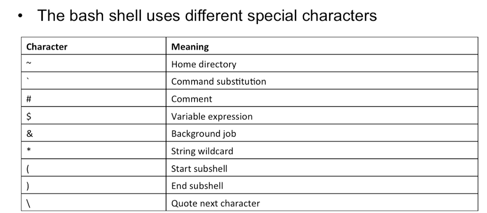

# Lição 2: Trabalhando com parâmetros e variáveis

## Terminologia

* Qualquer coisa que pode ser utilizada após um comando
    * `ls -l /etc` tem dois argumentos
* Uma opção é um argumento que foi desenvolvido especificamente para mudar o comportamento do comando.
* Parâmetro é um nome definido no script no qual o valor é atribuído.
* Variável é uma label que é armazenado na memória e contém um valor específico.

## Definindo e usando variáveis

* Usando variáveis fazem um script flexível
* Eles permitem que scripts dinâmicos podem ser facilmente modificados para agir em diferentes 

Ex: [variables-1](scripts/lesson2/variables1.sh)

### 3 maneiras de definir variáveis

* Estáticos: VARNAME=value
* Como um argumento para um script, usamos ele $1, $2 e etc. Dentro do script
* Ou pode usar de forma interativa, usando o `read`, ex: [Utilizando o read](scripts/lesson2/process-kill.sh)
* Melhores práticas: Use *uppercase* somente nos nomes das variáveis

**OBS: para debugar o script, execute ele usando `bash -x [nomedoscript]` colocando os sinais de + para mostra os shells e subshells**

### Anotações sobre read

* `read` vai parar o script
* O argumento será tratado como variável e o valor será armazenado na variável
    * Multiplos argumentos podem ser colocados em multiplas variáveis
    * Use `read -a somename` para escrever todas as palavras em um array com o nome provido
* Se nenhum input pro provido, o script vai pausar até o usuário pressionar a tecla Enter

## Entendendo variáveis e Subshells

* Variável só é efetiva no shell em que ela foi definida
* Para deixar as variáveis disponíveis no subshell, utilizamos o `export` antes da variável e do valor
* Não existe outra maneira de fazer variáveis disponíveis nos *parent shells*

**OBS: todas as vezes que executamos scripts, o próprio script é um subshell, é um ambiente a parte para executar o script, e após isso, volta para o *parent shell***

### Como deixar variáveis disponíveis para os subshells

* `/etc/profile` é processado quando aberto no login
    * todas as variáveis definidas aqui ficam disponíveis para todos os subshells daquele usuário
    * Uma versão específica do usuário pode ser usad em `~/.bash_profile`
* `etc/bashrc` é processado quando aberto um subshell
    * variáveis definidas aqui são incluídas nos subshells daqui pra frente
    * Para o usuário em específico, utilize o `~/.bashrc`

## Utilizando o source

* Utilizando o `sourcing` os conteúdos de um script podem ser incluídos em outro script
* Esse é um método comum de separar script estático de dinâmico
    * Dinâmico consiste em variáveis e funções
* Utilize o comando `source` ou . para incluir os scripts
* Não utilize `exit` no fim de um script que será incluído 

[Exemplo](scripts/lesson2/master.sh)

## Caracteres especiais

* Existem alguns caracters que o terminal vai interpretar, isso é conhecimento *command line parsing*
    * Exemplos:
        * `echo 2 * 3 > 5` => cria um arquivo chamado 5 e coloca como conteúdo o 2 seguindo de todos os arquivo no diretório atual(*) finalizando com o 3
        * `find . -name'*.doc'` no qual ele garante(pelas aspas simples) que o * não será interpretado, garantindo que o comando faça realmente o que foi projetado, encontrar um arquivo com name e que seja .doc.

## Lidando com argumentos do script

* Qualquer argumento que foi usado quando iniciou o script pode ser lido dentro do script
* Utilize $1, $2 e etc... para se referir para o primeiro, segundo e etc..
* $0 se refere ao nome do script
* Utilize `${nn}` ou **shift** para se referir a argumentos além de 9
* Argumentos que são guardados no $1 e etc...são somente leitura e não podem ser alterados dentro do script

[Exemplo de script com argumentos](scripts/lesson2/argument.sh)

### Lidando com argumentos de uma maneira inteligente

* O exemplo acima só funciona se você passar a quantidade e os argumentos conhecidos antes.
* Se não for o caso, utilize **for** para avaliar todos os posíveis argumentos
* Use `$@` para se referir a todos os argumentos passados, onde todos os argumentos são tratados um por um.
* Use `$#` para contar quantos argumentos foram passados
* Use `$*` se você precisa de uma string contento todos os argumentos(Utilizar somente em casos específicos)

[Exemplo](scripts/lesson2/smart-argument.sh)

#### Usando o shift

* Ele remove o primeiro argumento da lista para que o segundo seja guardado no $1
* É útil para versões mais antigas do shell que não entendem o ${10} e mais....
* Condidere o [exemplo](scripts/lesson2/uso-shift.sh)

## Command substitution

* Permite utilizar o resultado de um comando no script
* Promove uma flexibilidade extrema
* Duas sintaxes:
    * `command` (depreciada)
    * `$(command)` (recomendada)
* `ls -l ${which passwd}`
* Considere o seguinte [exemplo](scripts/lesson2/command-substitution.sh)

## Verificação de string

* Quando trabalhando com argumentos e entradas de texto, é util verificar a disponibilidade e se está correta a informação
* Use `test -z` para chegar se uma string é vazia
    * `test -z $1 && exit 1`
* Use `[[...]]` para checar oor padrões
    * `[[ $1=='[a-z]*' ]] || echo $1 não inicia com uma letra`

## Here Document

* É uma sessão do arquivo que é tratado como se fosse um arquivo separado
* Exemplo de [substituição do echo](scripts/lesson2/here-document1.sh)
* Exemplo para utilizar em comandos que possuem seu [próprio terminal](scripts/lesson2/here-document2.sh)

